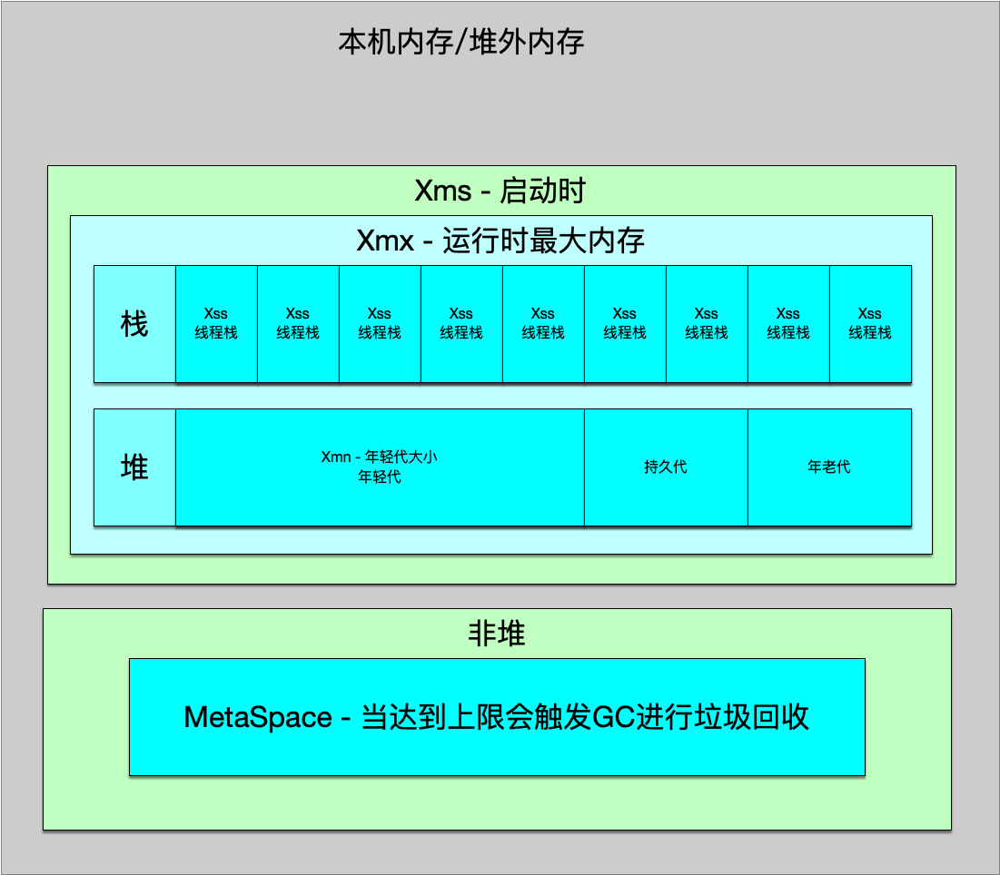

# 学习笔记
## 第一课作业实践

1、自己写一个简单的 Hello.java，里面需要涉及基本类型，四则运行，if 和 for，然后
自己分析一下对应的字节码，有问题群里讨论。
> 作业目录:/Week_01/GeekTimeDemo/src/pres/peixinyi/*

2、自定义一个 Classloader，加载一个 Hello.xlass 文件，执行 hello 方法，此文件内 容是一个 Hello.class 文件所有字节(x=255-x)处理后的文件。文件群里提供。

[作业跳转](/Week_01/GeekTimeDemo/src/pres/peixinyi/jvm0107/HelloXlass.java)

3、画一张图，展示 Xmx、Xms、Xmn、Meta、DirectMemory、Xss 这些内存参数的 关系。



4、检查一下自己维护的业务系统的 JVM 参数配置，用 jstat 和 jstack、jmap 查看一下 详情，并且自己独立分析一下大概情况，思考有没有不合理的地方，如何改进。
注意:如果没有线上系统，可以自己 run 一个 web/java 项目。

## 第二课作业
程序启动脚本

```bash
java -Xmx1g -Xms1g -XX:-UseAdaptiveSizePolicy -XX:+UseSerialGC -jar gateway-server-0.0.1-SNAPSHOT.jar
java -Xmx1g -Xms1g -XX:-UseAdaptiveSizePolicy -XX:+UseParallelGC -jar gateway-server-0.0.1-SNAPSHOT.jar
java -Xmx1g -Xms1g -XX:-UseAdaptiveSizePolicy -XX:+UseConcMarkSweepGC -jar gateway-server-0.0.1-SNAPSHOT.jar
java -Xmx1g -Xms1g -XX:-UseAdaptiveSizePolicy -XX:+UseG1GC -XX:MaxGCPauseMillis=50 -jar gateway-server-0.0.1-SNAPSHOT.jar
```

 


## 6.2 XX:+UseSerialGC(串行)

```bash
Attaching to process ID 4589, please wait...
Debugger attached successfully.
Server compiler detected.
JVM version is 11.0.9+7-LTS

using thread-local object allocation.
Mark Sweep Compact GC

Heap Configuration:
   MinHeapFreeRatio         = 40 //最小空闲堆 默认40%
   MaxHeapFreeRatio         = 70 //最大空闲堆 默认70%
   MaxHeapSize              = 1073741824 (1024.0MB) # 最大堆空间,在不指定的情况下 **1G<RAM:RAM/2?RAM/4**
   NewSize                  = 357892096 (341.3125MB)# 新生代的堆的大小 全部堆大小的1/3
   MaxNewSize               = 357892096 (341.3125MB)# JVM允许新生代的堆的大小
   OldSize                  = 715849728 (682.6875MB)# 老年代大小
   NewRatio                 = 2                     # 新生代与老年代的比值 1:2
   SurvivorRatio            = 8                     # 存活区与Eden区比例 S0:S1:Eden = 1:1:8
   MetaspaceSize            = 21807104 (20.796875MB)# 源数据区
   CompressedClassSpaceSize = 1073741824 (1024.0MB) # 压缩类空间大小
   MaxMetaspaceSize         = 17592186044415 MB     # 最大MateSpace大小
   G1HeapRegionSize         = 0 (0.0MB)             # 使用G1时会分成多个Region设置每个区块大小

Heap Usage:
New Generation (Eden + 1 Survivor Space):
   capacity = 322109440 (307.1875MB)
   used     = 21960792 (20.943443298339844MB)
   free     = 300148648 (286.24405670166016MB)
   6.817804532521618% used
Eden Space:
   capacity = 286326784 (273.0625MB)
   used     = 13286096 (12.670608520507812MB)
   free     = 273040688 (260.3918914794922MB)
   4.640186228613527% used
From Space:
   capacity = 35782656 (34.125MB)
   used     = 8674696 (8.272834777832031MB)
   free     = 27107960 (25.85216522216797MB)
   24.24273927569826% used
To Space:
   capacity = 35782656 (34.125MB)
   used     = 0 (0.0MB)
   free     = 35782656 (34.125MB)
   0.0% used
tenured generation:
   capacity = 715849728 (682.6875MB)
   used     = 11129560 (10.613975524902344MB)
   free     = 704720168 (672.0735244750977MB)
   1.5547341243105146% used
```

以上图表可以看出 新生代+老年代=最大堆空间,而metaspace则是在堆外,不算在堆内.

随机调用100次

- S0 - 存活区
- S1 - 存活区
- E  - eden
- O  - old
- M - matespace
- CCS - 类指针压缩空间使用率
- YGC-  年轻GC次数
- YGCT - 执行年轻GC时间
- FGC - full  GC次数
- FGCT - full GC时间
- CGC - 并发垃圾收集
- CGCT - 并发垃圾收集耗时(秒)
- GCT -  GC使用时间(秒)

```bash
  S0     S1     E      O      M     CCS    YGC     YGCT    FGC    FGCT    CGC    CGCT     GCT
  0.19   0.00  51.25   2.91  96.86  90.07    804    1.040     2    0.057     -        -    1.097
  0.19   0.00  51.25   2.91  96.86  90.07    804    1.040     2    0.057     -        -    1.097
  0.19   0.00  51.25   2.91  96.86  90.07    804    1.040     2    0.057     -        -    1.097
  0.19   0.00  51.25   2.91  96.86  90.07    804    1.040     2    0.057     -        -    1.097
  0.19   0.00  61.69   2.91  96.86  90.07    804    1.040     2    0.057     -        -    1.097
  0.00   0.10  14.05   2.91  96.86  90.07    805    1.041     2    0.057     -        -    1.098
  0.00   0.10  66.88   2.91  96.86  90.07    805    1.041     2    0.057     -        -    1.098
  0.13   0.00   9.81   2.91  96.86  90.07    806    1.042     2    0.057     -        -    1.099
  0.13   0.00  54.17   2.91  96.86  90.07    806    1.042     2    0.057     -        -    1.099
  0.13   0.00  92.73   2.91  96.86  90.07    806    1.042     2    0.057     -        -    1.099
  0.00   0.16  36.38   2.91  96.86  90.07    807    1.043     2    0.057     -        -    1.100
  0.00   0.16  84.08   2.91  96.86  90.07    807    1.043     2    0.057     -        -    1.100
  0.23   0.00  30.05   2.91  96.86  90.07    808    1.045     2    0.057     -        -    1.102
  0.23   0.00  74.98   2.91  96.86  90.07    808    1.045     2    0.057     -        -    1.102
```

从以上表格中可以看到,每次`E区`的空间不够就会执行一次`YGC`存活区`S1`与`S0`之间互相交换数据,而因为使用`wrk`调用的接口并没有产生`O区`的数据使`O区`存储满,所以并未触发FGC.可以通过`jconsole`进行手动触发`FullGC`

## 6.2 XX:+UseParallelGC(并行GC)

```bash
using thread-local object allocation.
Parallel GC with 8 thread(s)

Heap Configuration:
   MinHeapFreeRatio         = 40
   MaxHeapFreeRatio         = 70
   MaxHeapSize              = 1073741824 (1024.0MB)
   NewSize                  = 357564416 (341.0MB)
   MaxNewSize               = 357564416 (341.0MB)
   OldSize                  = 716177408 (683.0MB)
   NewRatio                 = 2
   SurvivorRatio            = 8
   MetaspaceSize            = 21807104 (20.796875MB)
   CompressedClassSpaceSize = 1073741824 (1024.0MB)
   MaxMetaspaceSize         = 17592186044415 MB
   G1HeapRegionSize         = 0 (0.0MB)

Heap Usage:
PS Young Generation
Eden Space:
   capacity = 268435456 (256.0MB)
   used     = 9599296 (9.15460205078125MB)
   free     = 258836160 (246.84539794921875MB)
   3.576016426086426% used
From Space:
   capacity = 44564480 (42.5MB)
   used     = 8652320 (8.251495361328125MB)
   free     = 35912160 (34.248504638671875MB)
   19.415283203125% used
To Space:
   capacity = 44564480 (42.5MB)
   used     = 0 (0.0MB)
   free     = 44564480 (42.5MB)
   0.0% used
PS Old Generation
   capacity = 716177408 (683.0MB)
   used     = 10671296 (10.17694091796875MB)
   free     = 705506112 (672.8230590820312MB)
   1.4900352734946924% used
```

与串行相比 缺少了一个新生代❓ 在同样使用20线程100连接的情况下,串行CG时间需要`0.744`而并行只有`0.560`相比快了`27%`

## XX:+UseConcMarkSweepGC(CMS)

```bash
Attaching to process ID 8995, please wait...
Debugger attached successfully.
Server compiler detected.
JVM version is 11.0.9+7-LTS

using thread-local object allocation.
Concurrent Mark-Sweep GC

Heap Configuration:
   MinHeapFreeRatio         = 40
   MaxHeapFreeRatio         = 70
   MaxHeapSize              = 1073741824 (1024.0MB)
   NewSize                  = 357892096 (341.3125MB)
   MaxNewSize               = 357892096 (341.3125MB)
   OldSize                  = 715849728 (682.6875MB)
   NewRatio                 = 2
   SurvivorRatio            = 8
   MetaspaceSize            = 21807104 (20.796875MB)
   CompressedClassSpaceSize = 1073741824 (1024.0MB)
   MaxMetaspaceSize         = 17592186044415 MB
   G1HeapRegionSize         = 0 (0.0MB)

Heap Usage:
New Generation (Eden + 1 Survivor Space):
   capacity = 322109440 (307.1875MB)
   used     = 243380456 (232.1056900024414MB)
   free     = 78728984 (75.0818099975586MB)
   75.55831210659333% used
Eden Space:
   capacity = 286326784 (273.0625MB)
   used     = 225064664 (214.63838958740234MB)
   free     = 61262120 (58.424110412597656MB)
   78.60412527805991% used
From Space:
   capacity = 35782656 (34.125MB)
   used     = 18315792 (17.467300415039062MB)
   free     = 17466864 (16.657699584960938MB)
   51.18622832245879% used
To Space:
   capacity = 35782656 (34.125MB)
   used     = 0 (0.0MB)
   free     = 35782656 (34.125MB)
   0.0% used
concurrent mark-sweep generation:
   capacity = 715849728 (682.6875MB)
   used     = 0 (0.0MB)
   free     = 715849728 (682.6875MB)
   0.0% used
```

## -XX:+UseG1GC(G1)

```bash
Attaching to process ID 14093, please wait...
Debugger attached successfully.
Server compiler detected.
JVM version is 11.0.9+7-LTS

using thread-local object allocation.
Garbage-First (G1) GC with 8 thread(s)

Heap Configuration:
   MinHeapFreeRatio         = 40
   MaxHeapFreeRatio         = 70
   MaxHeapSize              = 1073741824 (1024.0MB)
   NewSize                  = 1363144 (1.2999954223632812MB)
   MaxNewSize               = 643825664 (614.0MB)
   OldSize                  = 5452592 (5.1999969482421875MB)
   NewRatio                 = 2
   SurvivorRatio            = 8
   MetaspaceSize            = 21807104 (20.796875MB)
   CompressedClassSpaceSize = 1073741824 (1024.0MB)
   MaxMetaspaceSize         = 17592186044415 MB
   G1HeapRegionSize         = 1048576 (1.0MB)

Heap Usage:
G1 Heap:
   regions  = 1024
   capacity = 1073741824 (1024.0MB)
   used     = 84647080 (80.72574615478516MB)
   free     = 989094744 (943.2742538452148MB)
   7.883373647928238% used
G1 Young Generation:
Eden Space:
   regions  = 62
   capacity = 189792256 (181.0MB)
   used     = 65011712 (62.0MB)
   free     = 124780544 (119.0MB)
   34.25414364640884% used
Survivor Space:
   regions  = 17
   capacity = 17825792 (17.0MB)
   used     = 17825792 (17.0MB)
   free     = 0 (0.0MB)
   100.0% used
G1 Old Generation:
   regions  = 3
   capacity = 866123776 (826.0MB)
   used     = 1809576 (1.7257461547851562MB)
   free     = 864314200 (824.2742538452148MB)
   0.20892810590619326% used
```

从以上信息可以看出,G1是将堆分成了1024个区块.会给使用的区块添加标签,比如是Edenspace和存活区,老年代.

进行压测查看信息

```bash
wrk  -c 100 -t 20 -d 60s http://localhost:8088/api/hello
```

执行4次压测得出结果

[测试结果](https://www.notion.so/fea49d9f12c548a3a863d620dc5202e2)

由于测试时间较少,并且是在本地电脑.数据不一定正确.但是也能从表格中看出,

串行比起并行吞吐效率和GC耗时都会差一些.

并行吞吐量会高一些.

CMS在减少GC暂停时间但是吞吐会下降

G1吞吐和效率都十分不错