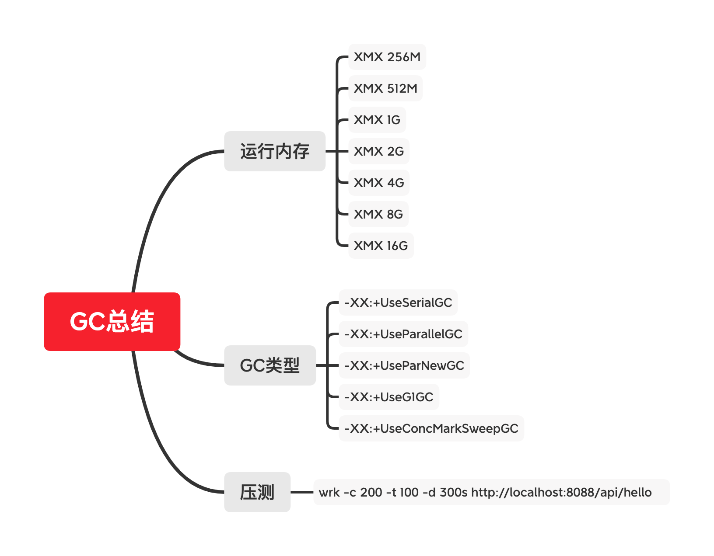
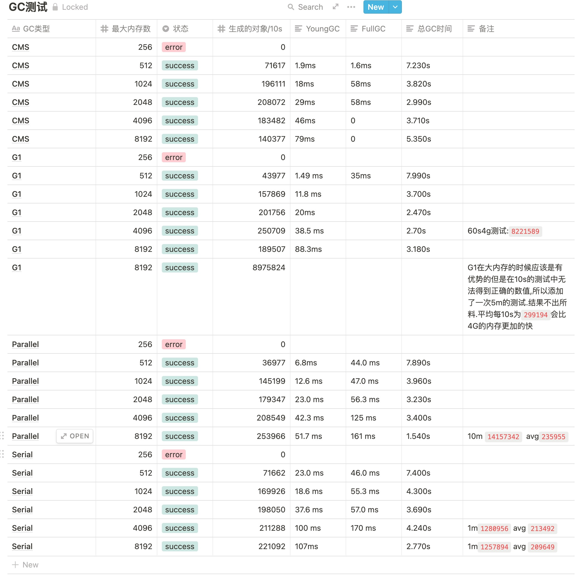

# 学习笔记

## 第三课作业

测试内容

## Serial
**512m**

```bash
Running 1m test @ http://localhost:8088/api/hello
  100 threads and 200 connections
  Thread Stats   Avg      Stdev     Max   +/- Stdev
    Latency    25.59ms   66.44ms 947.44ms   91.58%
    Req/Sec   345.18    132.67     3.12k    71.35%
  1949819 requests in 1.00m, 232.79MB read
  Socket errors: connect 0, read 30, write 0, timeout 0
Requests/sec:  32441.20
Transfer/sec:      3.87MB
```

**1g**

```bash
Running 1m test @ http://localhost:8088/api/hello
  100 threads and 200 connections
  Thread Stats   Avg      Stdev     Max   +/- Stdev
    Latency    30.20ms   73.84ms 979.19ms   90.93%
    Req/Sec   305.36    136.97     2.68k    65.04%
  1727653 requests in 1.00m, 206.26MB read
  Socket errors: connect 0, read 17, write 0, timeout 0
Requests/sec:  28745.98
Transfer/sec:      3.43MB
```

**2g**

```bash
Running 1m test @ http://localhost:8088/api/hello
  100 threads and 200 connections
  Thread Stats   Avg      Stdev     Max   +/- Stdev
    Latency    29.50ms   72.75ms   1.18s    90.59%
    Req/Sec   347.25    149.83     1.28k    67.71%
  1944656 requests in 1.00m, 232.17MB read
  Socket errors: connect 0, read 156, write 0, timeout 0
Requests/sec:  32361.60
Transfer/sec:      3.86MB
```

**4g**

```bash
Running 1m test @ http://localhost:8088/api/hello
  100 threads and 200 connections
  Thread Stats   Avg      Stdev     Max   +/- Stdev
    Latency    26.10ms   69.14ms 890.15ms   91.90%
    Req/Sec   341.35    134.31     2.75k    69.76%
  1923392 requests in 1.00m, 229.63MB read
  Socket errors: connect 0, read 63, write 0, timeout 0
Requests/sec:  32003.36
Transfer/sec:      3.82MB
```

**8g**

```bash
Running 1m test @ http://localhost:8088/api/hello
  100 threads and 200 connections
  Thread Stats   Avg      Stdev     Max   +/- Stdev
    Latency    28.66ms   73.43ms   1.27s    91.28%
    Req/Sec   333.33    137.90     1.53k    66.94%
  1876686 requests in 1.00m, 224.06MB read
  Socket errors: connect 0, read 131, write 0, timeout 0
Requests/sec:  31227.82
Transfer/sec:      3.73MB
```

### Parallel

```bash
Running 1m test @ http://localhost:8088/api/hello
  100 threads and 200 connections
  Thread Stats   Avg      Stdev     Max   +/- Stdev
    Latency    37.76ms  106.87ms   1.18s    91.80%
    Req/Sec   364.37    143.46     2.96k    70.93%
  1990473 requests in 1.00m, 237.64MB read
  Socket errors: connect 0, read 39, write 1, timeout 0
Requests/sec:  33116.26
Transfer/sec:      3.95MB
```

### ConcMarkSweep

```bash
Running 1m test @ http://localhost:8088/api/hello
  100 threads and 200 connections
  Thread Stats   Avg      Stdev     Max   +/- Stdev
    Latency    24.91ms   65.63ms   1.17s    92.02%
    Req/Sec   333.63    130.55     2.93k    70.39%
  1893004 requests in 1.00m, 226.00MB read
  Socket errors: connect 0, read 144, write 0, timeout 0
Requests/sec:  31495.59
Transfer/sec:      3.76MB
```

### G1

1G

```bash
Running 5m test @ http://localhost:8088/api/hello
  100 threads and 200 connections
  Thread Stats   Avg      Stdev     Max   +/- Stdev
    Latency    25.60ms   69.79ms   1.23s    90.73%
    Req/Sec   406.35    146.58     1.57k    75.51%
  11247741 requests in 5.00m, 1.31GB read
  Socket errors: connect 0, read 31, write 1, timeout 0
Requests/sec:  37480.44
Transfer/sec:      4.47MB
```

8G

```bash
Running 5m test @ http://localhost:8088/api/hello
  100 threads and 200 connections
  Thread Stats   Avg      Stdev     Max   +/- Stdev
    Latency    29.74ms  105.55ms   1.98s    93.30%
    Req/Sec   396.53    141.84     1.58k    73.92%
  10965283 requests in 5.00m, 1.28GB read
  Socket errors: connect 0, read 83, write 0, timeout 0
Requests/sec:  36539.81
Transfer/sec:      4.36MB
```

# 总结

## G1

在小内存的情况下,效率不是很高,但是在大内存长时间的情况下效率会比小内存情况下大很多。图表中因为测试的时间过于短暂导致了在8G内存情况下效率竟然还不如4G内存,

但是创建对象较少的情况下,大内存反而没有小内存的吞吐高

## CMS

在2G内存的时候,达到了效率和GC的最优点,减少了FullGC的暂停时间.而youngGC的时间也不会很久。但是在超过2G的时候youngGC的效率就开始下降,导致吞吐量减少.

### Parallel

更加注重吞吐量,但是在GC的暂停时间就不是很好

### Serial

作为最早的回收器对于大内存已经不堪重负,内存过于大后整体的效率也会下降