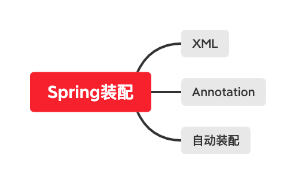

# 学习笔记 Week5

## 第九课必做作业

###  写代码实现 Spring Bean 的装配，方式越多越好(XML、Annotation 都可以), 提交到 Github

* [XML实现](GeekTimeWork9/src/main/java/pers/peixinyi/work9/AnnotationsConfigDemo.java)
* [注解方式实现](GeekTimeWork9/src/main/java/pers/peixinyi/work9/XmlConfigDemo.java)
* [自动装配](GeekTimeWork9/src/test/java/pers/peixinyi/work9/test/AutowiredConfigTest.java)

## 第十课必做作业

### 给前面课程提供的 Student/Klass/School 实现自动配置和 Starter
[链接](GeekTimeWork10/GeekTimeClass/src/main/java/pers/peixinyi/geektime)
### 研究一下 JDBC 接口和数据库连接池，掌握它们的设计和用法
[链接](GeekTimeWork10/GeekTimeJdbc/src/main/java/pers/peixinyi/jdbc/JdbcDemo.java)
